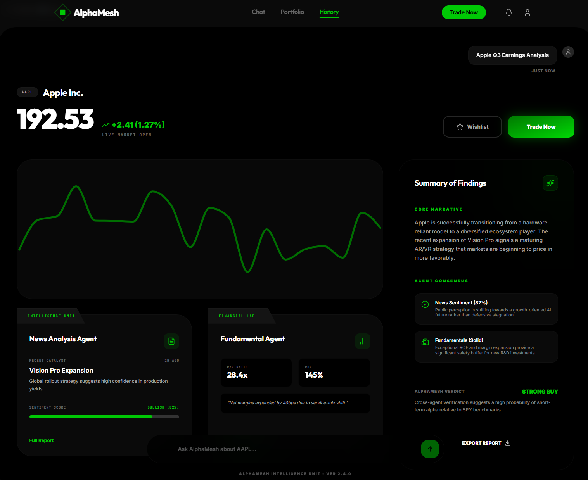
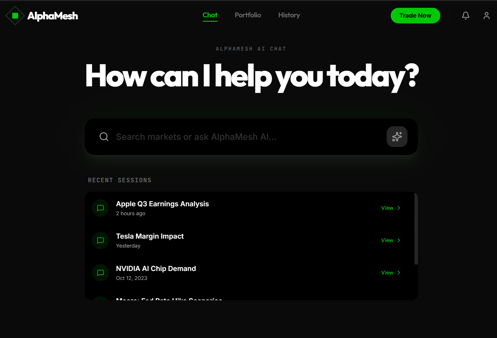
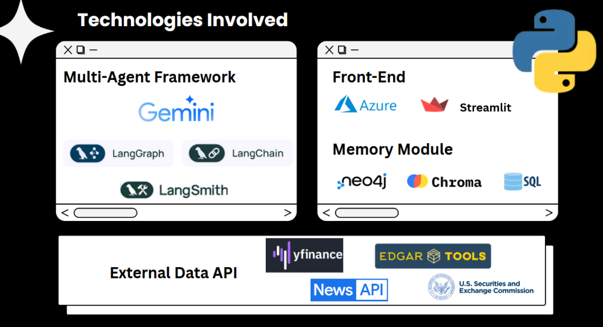
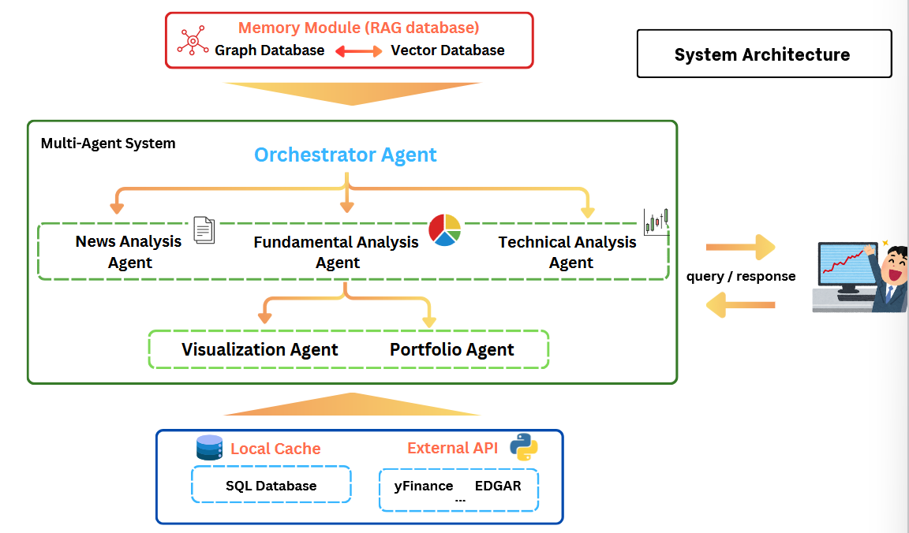
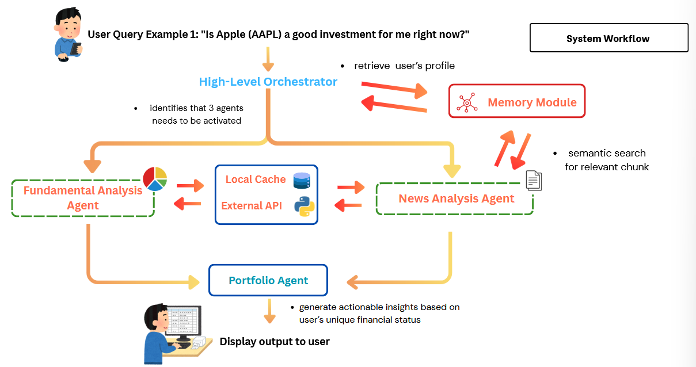
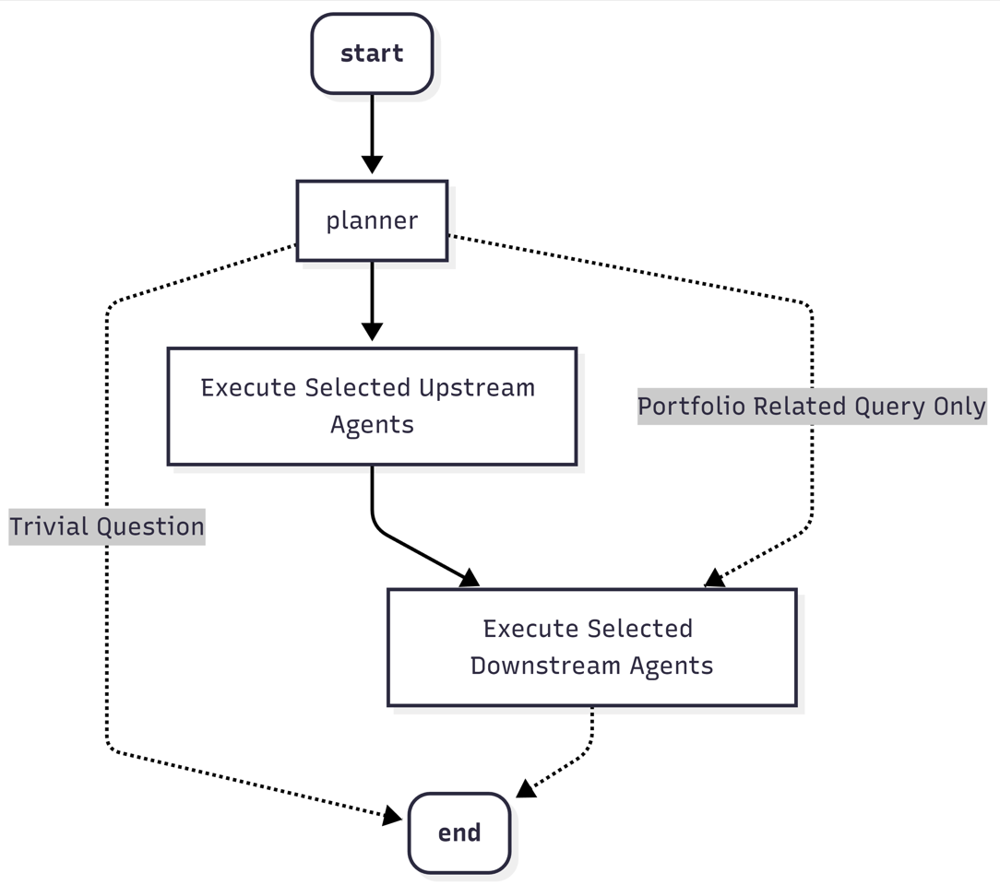
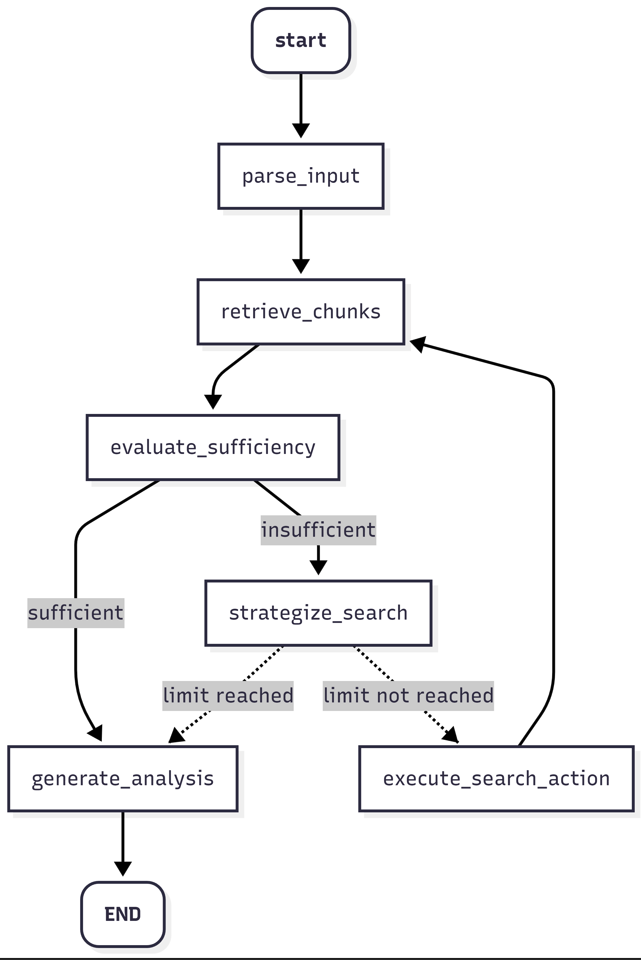
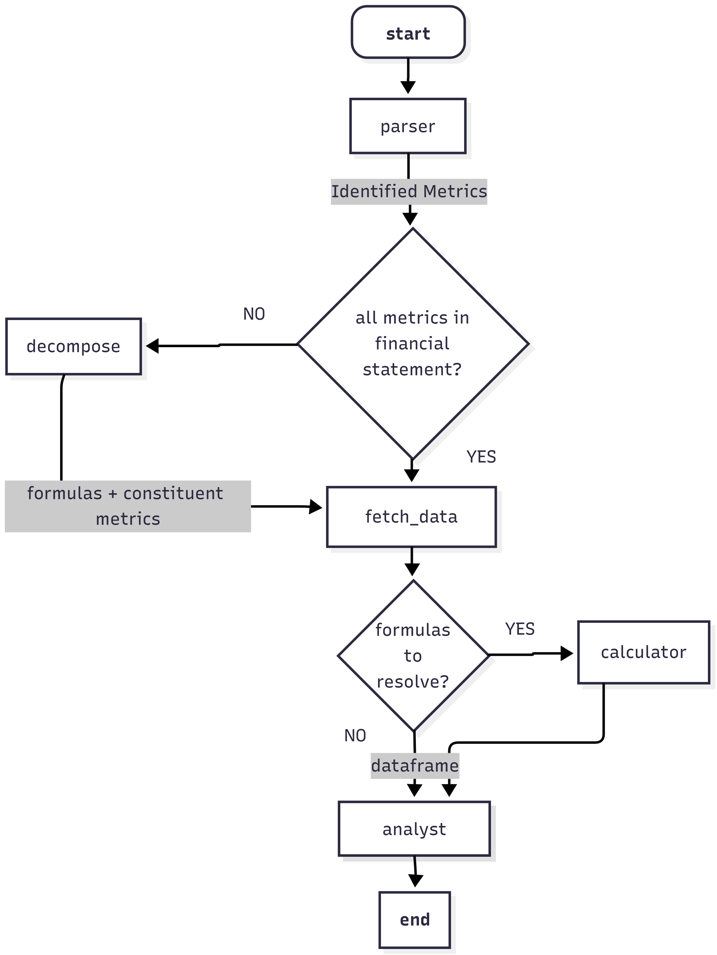
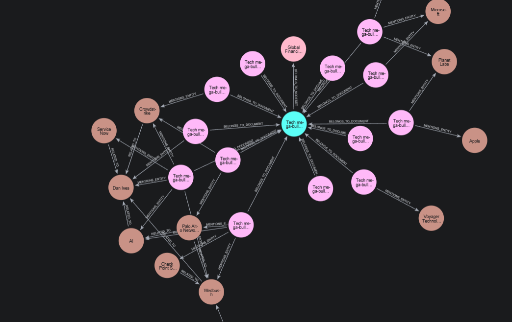

# AlphaMesh — Personalized Stock Investment App Powered by Multi-Agent LLM Orchestration

AlphaMesh is a personalized stock investment web app that uses a multi-agent LLM architecture to help retail investors make more informed decisions. The project focuses on three major problems in existing investment platforms: lack of deep personalization, information overload, and poor interpretability of financial data. It combines specialized analysis agents, a dual-layer memory system, and an orchestration layer to deliver more transparent and context-aware financial guidance.

## Project Overview

Traditional robo-advisors and stock apps often either provide shallow questionnaire-based personalization or overwhelm users with large amounts of charts, metrics, and market data. AlphaMesh was proposed as a proof-of-concept system that treats LLM-driven assistance as the core product rather than a side chatbot feature. The system is designed to help both beginner and experienced investors by offering tailored analysis, grounded responses, and a structure that can evolve with the user over time.

## Problem Statement

Retail investors often struggle with fragmented financial information, generic recommendations, and tools that are difficult to interpret. Existing platforms may provide raw numbers and charts, but they do not build a long-term understanding of the user’s goals, knowledge level, and preferences. This creates a need for a more transparent and personalized investment assistant that can retrieve relevant information, explain reasoning clearly, and present financial insights in a way that is easier to understand.

## Tech Stack

| Category                | Technology                                           |
| ----------------------- | ---------------------------------------------------- |
| Frontend                | Streamlit                                            |
| Language                | Python                                               |
| Agent Framework         | LangGraph, LangChain                                 |
| Model / Embeddings      | ChatGoogleGenerativeAI, GoogleGenerativeAIEmbeddings |
| Databases               | aiosqlite, Neo4j, ChromaDB                           |
| External Data           | NewsAPI, yfinance, EdgarTools                        |
| Monitoring / Debugging  | LangSmith                                            |
| Concurrency             | asyncio                                              |
| Deployment Architecture | Cloud-native client-server system on Microsoft Azure |

## Additional Technologies

| Category           | Tool / Technology    | Usage in Project                                                 |
| ------------------ | -------------------- | ---------------------------------------------------------------- |
| Orchestration      | LangGraph            | Coordinates multi-agent workflows and state transitions          |
| Retrieval          | ChromaDB             | Stores and retrieves semantically relevant text chunks           |
| User Profiling     | Neo4j / AuraDB       | Maintains evolving user preferences, concepts, and relationships |
| Structured Storage | aiosqlite            | Caches and stores structured financial data locally              |
| Financial Data     | yfinance, EdgarTools | Retrieves stock price and financial statement data               |
| News Retrieval     | NewsAPI              | Fetches relevant financial news articles                         |
| Monitoring         | LangSmith            | Tracks latency, token usage, and execution traces                |
| Async Execution    | asyncio              | Enables concurrent execution of tools and agent workflows        |

## Key Features

- Multi-agent LLM orchestration for specialized financial analysis
- Orchestrator Agent for planning, routing, and synthesis
- News Analysis Agent for qualitative market sentiment and cited summaries
- Fundamental Analysis Agent for quantitative metrics and multi-step financial calculations
- Dual-level memory architecture using Vector RAG and Graph RAG
- Long-term user profiling for evolving personalization
- Streamlit-based web interface
- Retrieval pipeline grounded in external financial data and local storage
- Planned Visualization Agent for turning structured financial data into charts
- Planned portfolio-aware recommendations based on user holdings and risk profile

## What This Project Demonstrates

- Multi-agent LLM system design
- Retrieval-augmented generation for high-stakes domains
- Graph-based long-term personalization
- Financial data processing and metric decomposition
- Async system design and external API integration
- Transparent AI workflows with traceable citations
- Practical product thinking for investor education and decision support

## System Architecture

AlphaMesh is designed as a cloud-native client-server web application. A user submits a query through the Streamlit interface, and the Orchestrator Agent first consults the memory module to retrieve the user’s context, such as experience level, explanation style, and investment preferences. Based on that profile, it decides which specialist agents to activate.

The upstream phase includes the News Analysis Agent and the Fundamental Analysis Agent. These agents gather and process unstructured and structured financial data respectively. The downstream phase is intended to use the Portfolio Agent and Visualization Agent to synthesize advice and present data more intuitively. The architecture is built around a hybrid memory model that combines vector-based retrieval for contextual recall and graph-based retrieval for structured long-term personalization.

## How It Works

### 1. User Query and Personalization

The workflow starts when a user enters a prompt in the Streamlit UI. The Orchestrator Agent retrieves the user’s profile from the memory module so the system can adapt its response style and analysis depth before making any tool calls.

### 2. Task Planning and Routing

The Orchestrator extracts parameters such as tickers, metrics, and date ranges, then determines which agents should be executed. In the reported example, a query about whether Apple is a good investment activates the Fundamental Analysis Agent and the News Analysis Agent based on the user’s preference for fundamental analysis and text-based explanations.

### 3. News Analysis

The News Analysis Agent follows a retrieve-evaluate-act loop. It first checks the vector store for relevant context, evaluates whether the retrieved context is sufficient, and only queries NewsAPI when more data is needed. It then generates a narrative summary with in-text citations so that claims remain traceable.

### 4. Fundamental Analysis

The Fundamental Analysis Agent handles structured quantitative requests, including multi-year financial data and compound metrics such as Price-to-Free-Cash-Flow. It uses local SQL storage to reduce unnecessary calls to external sources and supports decomposition of complex metrics into their underlying components to improve interpretation quality.

### 5. Synthesis and Memory Updates

The Portfolio Agent synthesizes outputs from upstream agents into a final user-facing response. Meanwhile, the memory layer stores and updates long-term user context. The Graph RAG models user preferences and relationships such as `INTERESTED_IN`, `DISLIKES`, and `CONFUSED_BY`, allowing the system to evolve its understanding of the user over time.

## Current Implementation Status

This project is best presented as an **in-development proof of concept** rather than a fully finished product. The Orchestrator Agent, News Analysis Agent, Fundamental Analysis Agent, Vector RAG, and Graph RAG all have working preliminary implementations. 

The Portfolio Agent currently acts mainly as a synthesis layer, while full portfolio-aware recommendations have been deferred to FYP 2. The Visualization Agent has been proposed in the architecture but had not yet started development at the time of this report.

The project already demonstrates working orchestration, retrieval, citation-aware news analysis, structured financial analysis, and evolving graph-based user profiling.

## Performance Summary

### System-Level Performance

| Metric                           | Target / Observation                | Status                                             |
| -------------------------------- | ----------------------------------- | -------------------------------------------------- |
| End-to-end response latency      | 30–40 seconds observed              | Meets sub-1-minute target                          |
| Response latency target          | Under 1 minute per complex request  | Defined in design targets                          |
| Citation accuracy target         | Above 80%                           | Target defined; manual auditing planned            |
| Personalization retrieval target | Above 90% context retrieval success | Target defined; graph demo shows evolving profiles |

### Agent-Level Performance

| Component                  | Reported Result                                                                |
| -------------------------- | ------------------------------------------------------------------------------ |
| News Analysis Agent        | ~7,000 tokens per request, ~11 seconds average latency                         |
| Fundamental Analysis Agent | Under 3,000 tokens per request, ~12 seconds average latency                    |
| Orchestrator Agent         | Produces coherent synthesized output from multiple agents                      | 
| Vector RAG                 | Fully functional for chunking, storage, retrieval, and metadata filtering      |
| Graph RAG                  | Functional in preliminary testing, with dynamic user-profile updates over time |

### Functional Validation

| Module                     | Validation Summary                                                                                                   |
| -------------------------- | -------------------------------------------------------------------------------------------------------------------- |
| Orchestrator Agent         | Successfully parses user intent, launches parallel agent execution, and synthesizes outputs                          |
| News Analysis Agent        | Retrieves relevant news, generates cited summaries, and can skip external API calls when local context is sufficient |
| Fundamental Analysis Agent | Handles multi-year financial data and multi-step financial metric computation                                        |
| Vector RAG                 | Supports semantic chunking, metadata extraction, deduplication, and retrieval                                        |
| Graph RAG                  | Updates graph structure from interactions and maintains evolving user preferences                                    |

## Technical Highlights

### Dual-Level Memory for Personalization

AlphaMesh combines Vector RAG for immediate contextual retrieval with Graph RAG for structured, long-term user profiling. This allows the system to recall semantically relevant content while also tracking how a user’s interests, preferences, and explanation style change over time.

### Transparent News Analysis

The News Analysis Agent is built around citation-aware output. It retrieves relevant sources, checks whether local context is sufficient, and generates responses that preserve in-text references back to the underlying articles.

### Efficient Quantitative Analysis

The Fundamental Analysis Agent uses local SQL caching and asynchronous workflows to reduce reliance on external APIs while supporting complex financial metric calculation and interpretation.

## Challenges

The report highlights several practical engineering challenges during development, including the steep learning curve of Cypher for Neo4j, API cost and data-coverage tradeoffs, LLM API rate limits during testing, and inconsistencies in external library documentation such as EdgarTools. These are useful to mention in a portfolio because they show real-world engineering tradeoff handling rather than only idealized design work.

## Future Improvements

- Full integration of Graph RAG and Vector RAG into one unified memory module
- Portfolio-aware recommendations using user holdings, asset weighting, and sector exposure
- Development of the Visualization Agent for automatic chart generation
- Technical Analysis Agent implementation
- Further optimization of latency and token consumption
- Stronger Graph RAG error handling and broader relationship coverage
- Expanded data sources beyond the current initial set of APIs
    
## Disclaimer

AlphaMesh is an academic proof-of-concept project focused on personalized financial analysis and investor education. It is not a trading system, does not execute real-time trades, and is not intended to replace certified financial advice. The current version is a preliminary implementation, and several planned capabilities are still scheduled for later development.
